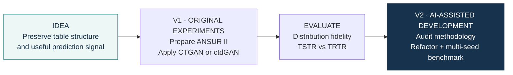
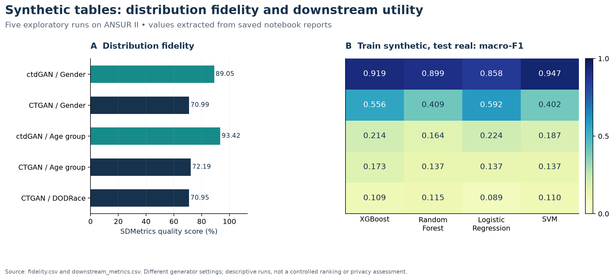

# Tabular synthesis with CTGAN & ctdGAN

This repository documents two distinct phases of the same project. They should not be
interpreted as one continuous experiment.

## V1 — my original exploratory experiments

V1 contains the exploratory notebooks and saved outputs I originally developed on the
ANSUR II anthropometric dataset. The goal was to test whether conditional tabular GANs
could preserve both distributional structure and downstream classification signal.

### V1 saved results

| Generator | Target | SDMetrics quality | TSTR macro-F1 across four models |
|---|---|---:|---:|
| ctdGAN | Gender | 89.05% | 0.8580–0.9472 |
| CTGAN | Gender | 70.99% | 0.4022–0.5922 |
| ctdGAN | Age_Group | 93.42% | 0.1642–0.2239 |
| CTGAN | Age_Group | 72.19% | 0.1370–0.1726 |
| CTGAN | DODRace | 70.95% | 0.0892–0.1145 |

These are historical saved outputs from the original exploratory runs. Generator settings
differed across experiments, Age-group feature selection occurred before the split, some
Logistic Regression fits emitted convergence warnings, and each generator was represented
by a single stochastic run. The table is therefore descriptive, not a controlled ranking.

The historical notebooks are preserved unchanged in [`notebooks/`](notebooks/).

## V2 — AI-assisted methodological development

V2 was developed after an AI-assisted audit of the historical workflow. AI tools were used
for methodological review, code inspection, refactoring, CI orchestration and reproducibility
checks. The research question, original experiments, methodological decisions and interpretation
remain under my authorship and review.

The V2 pipeline addresses the main weaknesses identified in V1:

- train/test split before target-dependent feature selection;
- matched headline generator architecture and 150-epoch training budget;
- StandardScaler for Logistic Regression and SVM;
- higher `max_iter` for Logistic Regression;
- dummy baselines;
- five pre-specified seeds;
- pinned ANSUR II source revision;
- untouched real holdout for TSTR/TRTR evaluation;
- raw standardised Wasserstein distance instead of an unvalidated percentage "trust score".

The first complete V2 run was GitHub Actions
[run #3](https://github.com/trungnb/Medical-CTGAN-Synthesis/actions/runs/36395443027):
**15/15 matrix jobs and the aggregate job succeeded.**

### V2 reproduced results

| Generator | Target | SDMetrics mean | TSTR macro-F1 range* |
|---|---|---:|---:|
| ctdGAN | Gender | **90.42%** | **0.8981–0.9690** |
| CTGAN | Gender | 79.61% | 0.8441–0.8648 |
| ctdGAN | Age_Group | **92.28%** | **0.2126–0.2334** |
| CTGAN | Age_Group | 87.77% | 0.1820–0.2048 |
| ctdGAN | DODRace | **91.07%** | **0.1855–0.2251** |
| CTGAN | DODRace | 82.34% | 0.1019–0.1147 |

*Range of the five-seed mean macro-F1 values across XGBoost, Random Forest,
Logistic Regression and SVM.

The main finding is more nuanced than V1: **ctdGAN still performs better than CTGAN across
all three targets under the V2 design, but the gap becomes much smaller for Gender once
CTGAN receives the same training budget and downstream preprocessing.** V2 also reinforces
that statistical fidelity and downstream utility are different properties: DODRace achieves
relatively high SDMetrics quality while TSTR macro-F1 remains modest.

For Age_Group, low absolute TSTR performance should be interpreted against the weak real-data
TRTR baseline rather than as synthesis failure alone.

### V2 limitations

V2 is a methodological development benchmark rather than a final definitive comparison.
Although the intended sampling policy was aligned, ARTSyn ctdGAN returned slightly fewer
than the requested rows in some multiclass seeds; realised sample counts are reported
explicitly. Exact duplicate rate was 0 in these runs, but that is only a basic memorisation
check and **not** a privacy guarantee.

See [benchmark_v2/](benchmark_v2/README.md) and the
[published V2 summaries](benchmark_v2/results/README.md).

## V1 notebook map

| Experiment | Notebook |
|---|---|
| ctdGAN · Gender | [pilot_project_sex](notebooks/pilot_project_sex.ipynb) |
| CTGAN · Gender | [ctgan_pilot_project_sex](notebooks/ctgan_pilot_project_sex.ipynb) |
| ctdGAN · Age group | [pilot_project_age](notebooks/pilot_project_age.ipynb) |
| CTGAN · Age group | [ctgan_ pilot_project_age](notebooks/ctgan_%20pilot_project_age.ipynb) |
| CTGAN · DODRace | [ctgan_pilot_project_ Race](notebooks/ctgan_pilot_project_%20Race.ipynb) |

**Data:** 6,068 ANSUR II records. This is an anthropometric dataset, not a clinical patient
cohort. DODRace is retained only as a dataset-inherited technical stress test and should not
be interpreted as a biological or clinical claim about race.

## Explore the project

[V1 methods](docs/methodology.md) ·
[Data and provenance](docs/data-provenance.md) ·
[V1 saved tables](results/README.md) ·
[V2 benchmark](benchmark_v2/README.md) ·
[V2 results](benchmark_v2/results/README.md)

**Author:** [trungnb](https://github.com/trungnb) ·
[Academic website](https://trungnb.github.io/)

Research and educational use only. This project has not been clinically validated.
See [licensing status](LICENSE) before reuse.
