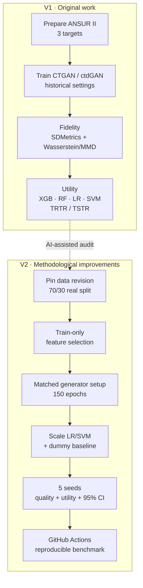

# Tabular synthetic data with CTGAN & ctdGAN

A two-stage project on the **ANSUR II anthropometric dataset (n=6,068)**: my original exploratory experiments (V1), followed by an **AI-assisted methodological redesign** (V2).

## V1 — original experiments

I tested CTGAN and ctdGAN on Gender, Age_Group and DODRace, then evaluated fidelity and TRTR/TSTR utility.

| Generator | Target | SDMetrics | TSTR macro-F1 |
|---|---|---:|---:|
| ctdGAN | Gender | 89.05% | 0.858–0.947 |
| CTGAN | Gender | 70.99% | 0.402–0.592 |
| ctdGAN | Age group | 93.42% | 0.164–0.224 |
| CTGAN | Age group | 72.19% | 0.137–0.173 |
| CTGAN | DODRace | 70.95% | 0.089–0.115 |

These are preserved historical runs, not a controlled model ranking.

## V2 — AI-assisted methodological development

V2 extends V1 through AI-assisted methodological audit, reproducibility engineering and multi-seed benchmarking.

GitHub Actions [run #3](https://github.com/trungnb/Medical-CTGAN-Synthesis/actions/runs/36395443027) completed **15/15 matrix jobs + aggregate successfully**.

| Target | CTGAN F1 | ctdGAN F1 | CTGAN quality | ctdGAN quality |
|---|---:|---:|---:|---:|
| Gender | 0.855 | **0.942** | 79.61% | **90.42%** |
| Age group | 0.192 | **0.226** | 87.77% | **92.28%** |
| DODRace | 0.108 | **0.209** | 82.34% | **91.07%** |

Values are means across the five-seed benchmark; F1 is averaged across the four downstream model means.

**Main result:** ctdGAN remains stronger under the redesigned benchmark, but the large Gender gap seen in V1 narrows substantially once CTGAN receives the revised training budget and preprocessing. The project also illustrates that **high statistical fidelity does not necessarily imply high downstream utility**.

## Repository

- [METHODS.md](METHODS.md) — design, provenance and interpretation.
- [notebooks/](notebooks/) — five preserved V1 notebooks.
- [results/](results/) — V1 aggregate tables and one overview figure.
- [benchmark_v2/](benchmark_v2/) — reproducible V2 code, tests and reviewed summaries.

This is an anthropometric benchmark, not a clinical patient study. DODRace is retained only as a dataset-inherited technical stress test. Exact duplicate checks are not privacy guarantees.

**Author:** [trungnb](https://github.com/trungnb) · [Academic website](https://trungnb.github.io/)
