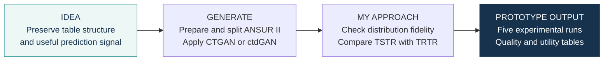
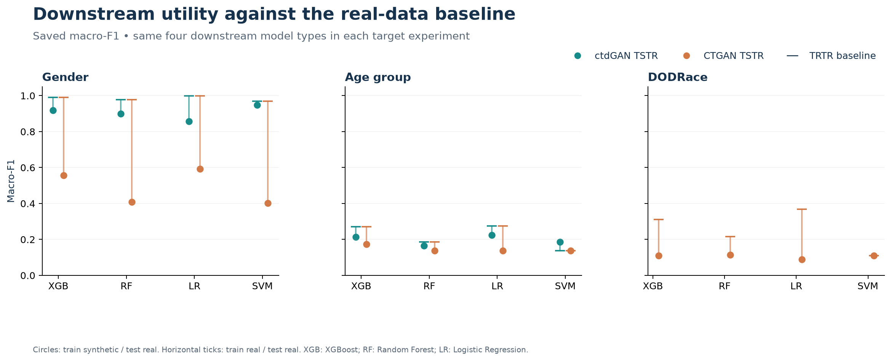

# Tabular synthesis with CTGAN & ctdGAN · prototype

**Idea:** explore whether generated anthropometric tables retain both distributional
structure and useful classification signal. **My approach:** fit conditional generators
to ANSUR II data, then inspect fidelity and train downstream classifiers on synthetic data.

## Benchmark v2

A separate research-grade pipeline is now available in [`benchmark_v2/`](benchmark_v2/README.md).
It fixes the main design limitations identified in the historical notebooks: train-only feature
selection, matched generator settings, scaled Logistic Regression/SVM, a dummy baseline, pinned
input provenance and five pre-specified random seeds. **The v2 benchmark has not yet been fully
executed, so no new scientific result is claimed here.** Historical outputs below remain unchanged.

## What the prototype produced

| Generator | Target | SDMetrics quality | TSTR macro-F1 across four models |
|---|---|---:|---:|
| ctdGAN | Gender | 89.05% | 0.8580–0.9472 |
| CTGAN | Gender | 70.99% | 0.4022–0.5922 |
| ctdGAN | Age_Group | 93.42% | 0.1642–0.2239 |
| CTGAN | Age_Group | 72.19% | 0.1370–0.1726 |
| CTGAN | DODRace | 70.95% | 0.0892–0.1145 |

TSTR = train synthetic, test real. Ranges cover XGBoost, Random Forest, Logistic
Regression and SVM; they are not confidence intervals. Scores are extracted from
saved notebook outputs. Generator settings differ across experiments, so the table
describes these runs rather than a controlled model ranking.

View the downstream comparison against the real-data baseline

TRTR = train real, test real. Full accuracy, macro-F1 and AUC values are in
[downstream_metrics.csv](results/downstream_metrics.csv).

## What I built

- Prepared ANSUR II tables and separate experiments for three demographic targets.
- Applied CTGAN and ARTSyn's ctdGAN; generated synthetic samples for downstream comparison.
- Collected SDMetrics reports, custom distribution scores, and TSTR / TRTR metrics.

**Data:** 6,068 records in the combined ANSUR II tables; the notebooks use 1,820 training
and 4,248 holdout records. This is an anthropometric dataset, not a clinical patient
cohort. Age-group notebooks select 23 features before the split. [Methods and settings](docs/methodology.md).

## Notebook map

| Experiment | Notebook |
|---|---|
| ctdGAN · Gender | [pilot_project_sex](notebooks/pilot_project_sex.ipynb) |
| CTGAN · Gender | [ctgan_pilot_project_sex](notebooks/ctgan_pilot_project_sex.ipynb) |
| ctdGAN · Age group | [pilot_project_age](notebooks/pilot_project_age.ipynb) |
| CTGAN · Age group | [ctgan_ pilot_project_age](notebooks/ctgan_%20pilot_project_age.ipynb) |
| CTGAN · DODRace | [ctgan_pilot_project_ Race](notebooks/ctgan_pilot_project_%20Race.ipynb) |

The original project folder name reflects a biomedical motivation. This release
documents the ANSUR II experiments actually present in the notebooks. Distribution
scores and synthetic generation do not by themselves establish a privacy guarantee.

## Explore the project

[Methods](docs/methodology.md) · [Data and provenance](docs/data-provenance.md) · [Saved tables](results/README.md) · [Viewing / chart rendering](docs/environment.md)

**Status:** exploratory prototype. Results shown here were saved during earlier experiments;
the notebooks were not rerun for this release. Figures were rendered from saved tables.

**Author:** [trungnb](https://github.com/trungnb) · [Academic website](https://trungnb.github.io/)

Research and educational use only; this prototype has not been clinically validated.
See [licensing status](LICENSE) before reuse.
